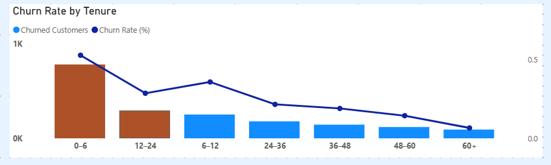
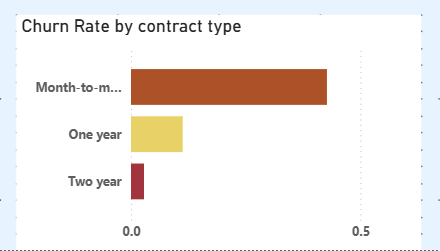
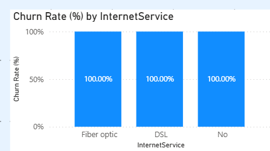
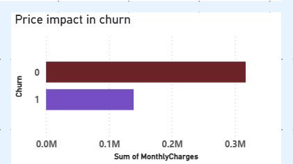
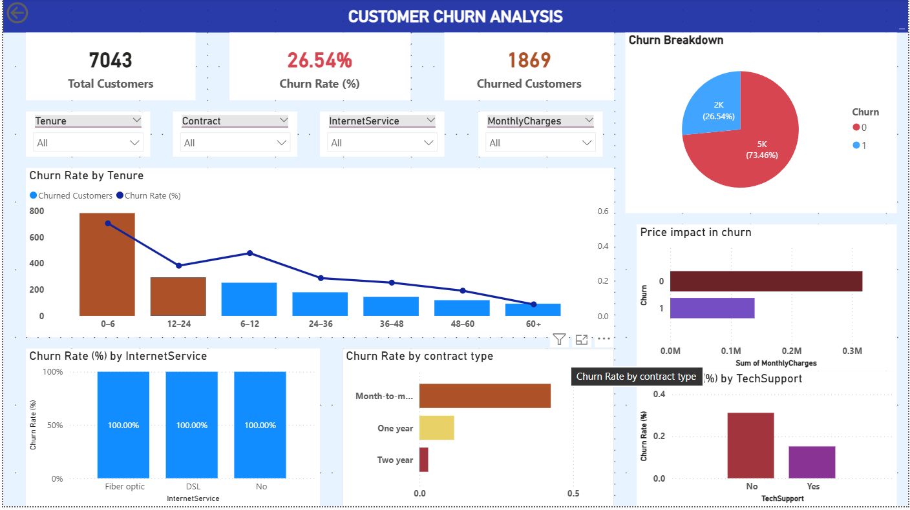

📊 Customer Churn Analysis Dashboard (Power BI + Python)

📌 Project Overview

Customer churn is a critical business problem for subscription-based companies.
This project combines Python (for exploratory data analysis) and Power BI (for interactive dashboards) to analyze customer churn and identify high-risk segments, churn patterns, and key churn drivers.

The project demonstrates an end-to-end analytics workflow, starting from data exploration in Python to business-ready visualization in Power BI.

🎯 Objectives

Analyze customer churn behavior using Python and Excel

Perform exploratory data analysis (EDA)

Prepare clean, analysis-ready data

Build interactive Power BI dashboards

Identify who is churning, when they churn, and why churn happens

🗂 Dataset

Source: Telco Customer Churn Dataset

Records: ~7,000 customers

Target Variable: Churn (Yes / No)

Key Columns

1.customerID

2.tenure

3.Contract

4.InternetService

5.MonthlyCharges

6.TechSupport

7.Churn,etc

🛠 Tools & Technologies

!Python (EDA & preprocessing)

!pandas

!numpy

!matplotlib

!seaborn

!Power BI Desktop

!Power Query

!DAX

!Excel

🐍 Python Analysis (EDA & Data Understanding)

Python was used to:

Inspect dataset structure and data types

Handle missing and inconsistent values

Analyze overall churn distribution

Explore churn patterns across:

Contract type

Monthly charges

Tenure

Internet service

Validate insights before dashboard creation

Image to add here:
images/python_eda.png

🔄 Data Preparation (Power Query)

Performed in Power BI Power Query:

Converted churn values into a numeric flag (Churn_Flag)

Created business-friendly Tenure Groups

Cleaned categorical values

Fixed data types for modeling

Prepared data for efficient DAX calculations

📐 Key Measures (DAX)

Total Customers
Calculated using distinct customer IDs.

Churned Customers
Calculated by filtering churned customers.

Churn Rate
Calculated as the average of the churn flag.

📊 Dashboard Components
1️⃣ KPI Summary

Total Customers

Churned Customers

Churn Rate (%)

2️⃣ Churn Breakdown

Shows the distribution of Active vs Churned customers using a donut chart.

3️⃣ Churn Rate by Tenure

Combo chart visualization:

Bars → Churned Customers

Line → Churn Rate (%)

Helps identify early churn behavior.

Image to add here:

4️⃣ Churn Rate by Contract Type

Highlights churn risk across different contract types.

Image to add here:

5️⃣ Churn Rate by Internet Service

Analyzes churn differences based on internet service type.

Image to add here:

6️⃣ Pricing & Support Impact

Comparison of average monthly charges (Churned vs Active)

Impact of technical support availability on churn

Image to add here:

7️⃣ Interactive Filters

Dashboard slicers allow filtering by:

Tenure Group

Contract

Internet Service

Monthly Charges

🧠 Key Insights

Month-to-month contracts have the highest churn rate

Customers with shorter tenure churn more frequently

Higher monthly charges are associated with higher churn

Customers without tech support are more likely to churn

Fiber optic customers show higher churn compared to DSL users

📌 Business Recommendations

Improve onboarding experience for early-tenure customers

Encourage long-term contracts with incentives

Review pricing strategies for high-charge customers

Promote technical support to reduce churn risk

📷 Full Dashboard Preview

Image to add here:

